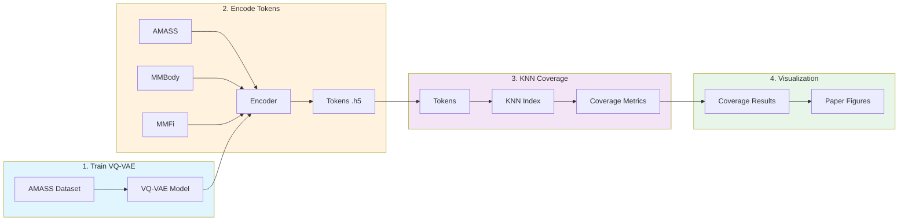
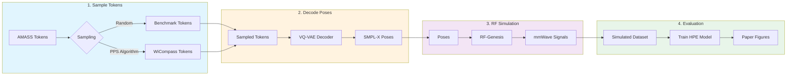

# README

This repo is the official implementation of the MobiCom '26 paper "WiCompass: Oracle-driven Data Scaling for mmWave Human Pose Estimation", which proposes a highly efficient data collection framework for mmWave human pose estimation. [Project page](https://galaxywalk.github.io/project/wicompass/)

**Highlight:** At matched data budgets, WiCompass reduces OOD MPJPE by roughly 25–30 mm compared with conventional data collection. By achieving broader coverage with roughly one-eighth as many samples, it suggests the potential to reduce data-collection effort by up to 8×.

## News

- **[2026-07]** Meet [Wave2Body](https://galaxywalk.github.io/project/wave2body/), our new radar-to-body token translation framework for mmWave human pose estimation. Its clean, modular design delivers stronger cross-domain generalization with up to 31× fewer training FLOPs and 89.81× fewer inference FLOPs—making it easy to reproduce, extend, and adapt to your own dataset. Give it a try!

## Quick Video

https://github.com/user-attachments/assets/125de2d4-33f8-4eeb-9259-e6900838e27c

## Project Introduction

WiCompass is a data collection framework that leverages VQ-VAE to learn a compact latent space of human poses from large-scale motion capture datasets (AMASS). It then uses a coverage-aware sampling algorithm to select diverse and representative poses for mmWave data collection, significantly improving data efficiency for human pose estimation models. This repo includes:

- VQ-VAE based pose encoding: Compress high-dimensional human poses into discrete tokens
- KNN coverage analysis: Quantify dataset coverage in latent space
- PPS sampling algorithm: Prioritized sampling for efficient data collection
- End-to-end evaluation: From data sampling to pose estimation model training

### Project Structure

```
Wi-compass/
├── src/
│   ├── wicompass/                 # Core WiCompass framework
│   │   ├── model/                 # VQ-VAE model implementation
│   │   ├── train/                 # Training scripts for VQ-VAE
│   │   ├── evaluation/            # Encode datasets into tokens
│   │   ├── knn_coverage/          # KNN coverage calculation
│   │   ├── token_space_sampling/  # Sampling algorithms (random, PPS)
│   │   └── visualization/         # Visualization tools
│   └── pose_estimation/           # mmWave pose estimation model
│       ├── model/                 # Point Transformer model
│       ├── dataset/               # Dataset loaders (MMFi, mmBody)
│       ├── train/                 # Training scripts
│       └── evaluate/              # Evaluation metrics
├── experiments/                   # Experiment scripts and notebooks
│   ├── vqvae_microbenchmark/      # VQ-VAE performance evaluation
│   ├── pilot_study/               # Pilot studies about mmWave HPE model and data
│   │   ├── data_efficiency/       # Data efficiency evaluation
│   │   ├── leave_one_out/         # Leave-one-out generalization test
│   │   └── model_size/            # Model size vs performance analysis
│   ├── knn_coverage/              # Data coverage analysis
│   ├── simulation_scaling/        # Simulator-based data scaling
│   └── real_world_scaling/        # Real-world data scaling
├── datasets/                      # Dataset storage (symbolic links)
├── logs/                          # Training logs and model weights
├── model_zoo/                     # Pre-trained models
└── tools/                         # Utility scripts
```

## System Requirements

### Hardware Requirements
- **GPU**: NVIDIA GPU with CUDA 12.x compatible driver (recommended for VQ-VAE training and KNN coverage computation)
- **RAM**: At least 16GB (32GB recommended for large-scale experiments)
- **Storage**: ~100GB free space (for datasets, models, and experiment logs)

## Quick Start

### 1. Clone the Artifact Source

Clone the repository instead of using GitHub's ZIP download so that the PointNet++ submodule is available:

```bash
git clone --recurse-submodules https://github.com/MobiCom26AE/WiCompass.git
cd WiCompass
git submodule update --init --recursive
```

### Installation

#### 2. Create Conda Environment
```bash
conda create -n wicompass python=3.11 -y
conda activate wicompass
```

#### 3. Install Core Dependencies
```bash
# Install chumpy first (required by human_body_prior)
pip install --no-build-isolation chumpy

# Install project dependencies
pip install -r requirements.txt

# Install the project in development mode
pip install -e .
```

#### 4. Install PointNet++ for mmWave Pose Estimation
```bash
# Initialize and update submodules
git submodule update --init --recursive

# Modify CUDA architecture list for compatibility
# Edit: submodules/Pointnet2_PyTorch/pointnet2_ops_lib/setup.py
# Replace the TORCH_CUDA_ARCH_LIST line with:
# os.environ["TORCH_CUDA_ARCH_LIST"] = "7.0;7.5;8.0;8.6;8.9"

# Compile PointNet++ CUDA extensions
cd submodules/Pointnet2_PyTorch/pointnet2_ops_lib
export CC=/usr/bin/gcc
export CXX=/usr/bin/g++  # Use system gcc if conda gcc causes issues
pip install -e . --no-build-isolation
```

### Setup Workspace

All the datasets, training logs, and model weights are packaged into a workspace folder. The workspace (~83 GB total) is split into per-component archives so you can download only what you need.

| Component | Size | Description |
|-----------|------|-------------|
| model_zoo | 1.6 GB | Pre-trained model weights |
| wicompass_logs | 34 GB | Training logs, encoded tokens, KNN results |
| AMASS_preproc | 3.2 GB | Processed AMASS motion capture dataset |
| mmfi | 1.6 GB | MMFi dataset |
| mmbody | 34 GB | mmBody dataset |
| real_world | 429 MB | Real-world collected dataset |
| simulation_datasets | 8.2 GB | Simulated mmWave dataset |

For reproducing paper figures from existing logs, you only need `model_zoo` + `wicompass_logs` (~36 GB). For re-training models, you will also need the dataset components.

#### Download via rclone (Recommended)

We use [rclone](https://rclone.org/) to transfer large files from Google Drive with resume support.

Step 1. Install rclone:
```bash
# Linux
curl https://rclone.org/install.sh | sudo bash
# macOS
brew install rclone
```

Step 2. Configure rclone with Google Drive:
```bash
rclone config
```
Follow the interactive prompts:
- Choose `n` (new remote), name it `gdrive`
- Storage type: choose `drive` (Google Drive)
- `client_id` and `client_secret`: leave blank (press Enter)
- Scope: choose `1` (full access)
- `service_account_file`: leave blank
- Advanced config: `n`
- Auto config: if you have a browser on the machine, choose `y`. Otherwise choose `n` and follow the instructions to authorize on another machine with a browser, then paste the token back.
- Shared drive: `n`

Step 3. Add the shared WiCompass folder to your Google Drive:
- Open the shared link: https://drive.google.com/drive/folders/1GDgcJ-6fq4TW-AmuZPPa-i_UvshAEg79?usp=sharing
- Click "Organize" > "Add shortcut" to add it to your Drive (required for rclone to see the folder)

Step 4. Download workspace:
```bash
# Download all components (~83 GB)
python tools/download_workspace.py --workspace ~/wicompass_workspace

# Or download only the minimal set for reproducing paper figures (~36 GB)
python tools/download_workspace.py --workspace ~/wicompass_workspace --minimal

# Or download specific components
python tools/download_workspace.py --workspace ~/wicompass_workspace --components model_zoo wicompass_logs mmfi

# List available components and sizes
python tools/download_workspace.py --list
```

Step 5. Create symbolic links:
```bash
python tools/setup_workspace.py --workspace ~/wicompass_workspace
```

#### Manual Download

You can also download the `.tar.gz` archives directly from Zenodo, Google Drive, or Baidu Netdisk. The versioned workspace data/model archive is preserved on Zenodo, and all three sources contain the same files.

- Permanent Zenodo archive: [https://zenodo.org/records/20907837](https://zenodo.org/records/20907837)
- Google Drive link: https://drive.google.com/drive/folders/1GDgcJ-6fq4TW-AmuZPPa-i_UvshAEg79?usp=sharing
- Baidu Netdisk link for users in mainland China: https://pan.baidu.com/s/1cy5-yM54qu6ecGV0US3QBQ?pwd=xqry
- Download the archives you need, extract them into one directory, then run:
```bash
python tools/setup_workspace.py --workspace /path/to/wicompass_workspace
```

This creates the following structure:

```bash
Wi-compass/
├── logs/                           → wicompass_workspace/wicompass_logs
├── model_zoo/                      → wicompass_workspace/model_zoo
└── datasets/
    ├── AMASS_preproc               → wicompass_workspace/AMASS_preproc
    ├── MMFi                        → wicompass_workspace/mmfi
    └── mmBody                      → wicompass_workspace/mmbody
    └── real_world                  → wicompass_workspace/real_world
    └── simulation_datasets         → wicompass_workspace/simulation_datasets
```

## Reproducibility

This section introduces how to reproduce all the results in the paper, including pilot studies and evaluation. We provide different levels of experiment traces:

1. Experiment logs. Always json based. You can use experiment scripts (always jupter notebook) to read logs and reproduce the figures of the main results in the paper.
2. Model Weights. All the model weights are provided so you can also inference and evaluate the models. We mark all related parts as [optional].
3. Training Models. All the datasets and training scripts are provided. You can even re-train the models and reproduce all the results. We mark all related parts as [optional].

We suggest you to follow the order to reproduce our results.


Before running the Jupyter notebooks, make sure the notebook kernel uses this repository's `wicompass` environment. Register it once after installation:

```bash
python -m ipykernel install --user --name wicompass --display-name WiCompass
```

The notebooks use paths relative to their experiment directory. Start Jupyter from that directory, select the `WiCompass` kernel, and open the notebook. For example:

```bash
cd experiments/vqvae_microbenchmark
python -m jupyter lab vqvae_performance.ipynb
```

For a non-interactive run of the same notebook:

```bash
cd experiments/vqvae_microbenchmark
python -m jupyter nbconvert --to notebook --execute vqvae_performance.ipynb \
    --ExecutePreprocessor.kernel_name=wicompass \
    --output vqvae_performance.executed.ipynb
```

Using the system/default `python3` kernel can miss dependencies such as `h5py` even when the `wicompass` conda environment is correctly installed.


| Figure | Section |
|--------|---------|
| Figure 10 | [VQVAE Microbenchmarks](#vqvae-microbenchmarks) |
| Figure 7, 8 | [Data Coverage](#data-coverage) |
| Figure 6 | [Data Scaling](#data-scaling-sample-data-for-simulator-based-data-collection) |
| Figure 9 | [Real World Validation](#real-world-data-scaling-sample-data-for-real-world-data-collection) |
| Figure 1 | [Pilot Studies](#pilot-studies) |

### VQVAE Microbenchmarks

See the code in `experiments/vqvae_microbenchmark`. All the experiment results are saved in `logs/vqvae/*` as `training_result.json` and `testing_result.json`. 

You can directly visualize the experiment results of VQ-VAE models with different parameters by running `vqvae_performance.ipynb`.

[Optional] To re-calculate the results, download and link the `wicompass_logs` component. `batch_evaluate_models.py` additionally needs the `mmbody` component:

```bash
python tools/download_workspace.py --workspace ~/wicompass_workspace \
    --components wicompass_logs mmbody
python tools/setup_workspace.py --workspace ~/wicompass_workspace
```

Then run the scripts from the repository root (they are also safe to invoke from the experiment directory):

```bash
python experiments/vqvae_microbenchmark/recover_training_results.py
python experiments/vqvae_microbenchmark/batch_evaluate_models.py
```

[Optional] If you want to re-train all the models, please refer to `src/wicompass/train/train_vqvae.py`. It will load the config in `src/wicompass/configs` and load the (processed) AMASS datasets.

### Data Coverage

See the code in `experiments/knn_coverage`. The full pipeline of building data coverage evaluation is as followings, we provide the model weight or data cache during each stage so you can skip to the final step to reproduce our results quickly.



1. [Optional] Train a VQ-VAE model. You can train it by yourselves or use our provided weights. It is stored in `logs/vqvae/vqvae_tokennum16_tokenclass64/best_model.pth`. If you want to use our provided weights, skip this step.

2. [Optional] Encode AMASS datasets and mmWave human pose estimation datasets into tokens. You can do it by model inference or use our provided tokens. They are stored in `logs/wicompass/encoded_tokens/BMLmovi-BMLrub-CMU-GRAB-KIT-MOYO-MoSh-PosePrior-WEIZMANN_tokens.h5`, `logs/wicompass/encoded_tokens/MMBody_tokens.h5`, and `logs/wicompass/encoded_tokens/MMFi_tokens.h5`. If you want to manually do it, you can run the script of `src/wicompass/evaluation/encode_datasets_into_tokens.py`. If you want to use our provided tokens, skip this step.

```bash
python src/wicompass/evaluation/encode_datasets_into_tokens.py --dataset MMFi --dataset-type mmfi
python src/wicompass/evaluation/encode_datasets_into_tokens.py --dataset MMBody --dataset-type mmbody
```

3. [Optional] Calculate the KNN coverage. You can use the scripts of `src/wicompass/knn_coverage/run_knn_sweep.py` to export the knn coverage parameters of the latent spaces from different datasets with different $k$, including intra-coverage and cross-coverage (needs about 12 GPU hours for all pre-defined $k$). Or you can use our provided calculated KNN coverage indexes and results, which are stored in `logs/wicompass/knn_coverage`. If you want to use our provided tokens, skip this step.

```bash
# for mmbody
python src/wicompass/knn_coverage/knn_coverage.py \
    --dataset-A logs/wicompass/encoded_tokens/BMLmovi-BMLrub-CMU-GRAB-KIT-MOYO-MoSh-PosePrior-WEIZMANN_tokens.h5 \
    --dataset-B logs/wicompass/encoded_tokens/MMBody_tokens.h5 \
    --metric cosine --k 2 --multi-gpu \
    --sample-ratio 1.0 \
    --output logs/wicompass/knn_coverage/mmbody/k2

# for mmfi
python src/wicompass/knn_coverage/knn_coverage.py \
    --dataset-A logs/wicompass/encoded_tokens/BMLmovi-BMLrub-CMU-GRAB-KIT-MOYO-MoSh-PosePrior-WEIZMANN_tokens.h5 \
    --dataset-B logs/wicompass/encoded_tokens/MMFi_tokens.h5 \
    --metric cosine --k 2 --multi-gpu \
    --sample-ratio 1.0 \
    --output logs/wicompass/knn_coverage/mmfi/k2
```

4. Data analysis and visualization. Run the code of `experiments/knn_coverage/intra_knn_distribution.ipynb` and `experiments/knn_coverage/knn_coverage.ipynb`.


### Data Scaling (Sample Data for Simulator-based Data Collection)

In data scaling evaluation, we use simulator ([RF-Genesis, SENSYS'23](https://github.com/Asixa/RF-Genesis)) to generate three mmWave human pose estimation datasets:
1. Benchmark. Randomly picked 40k motions from AMASS latent space, serves as unseen test set.
2. mmBody trace. Use the 40k SMPL-X groundtruth in mmBody datasets and render the mmWave signals based on them.
3. Wicompass. Use WiCompass to select "important and unique" motions in human pose latent space and render their mmWave signals.

The full pipeline for data scaling evaluation is as follows. We provide model weights and cached data at each stage so you can skip to the final step to reproduce our results quickly.



1. [Optional] Sample from Token Space. You can call the sampling algorithm to sample important poses in the VQ-VAE latent space or use our provided sampled tokens. The sampling algorithm is:

```bash
# sample tokens randomly (for testing set)
python src/wicompass/token_space_sampling/random_sampling.py \
    --A-path logs/wicompass/encoded_tokens/BMLmovi-BMLrub-CMU-GRAB-KIT-MOYO-MoSh-PosePrior-WEIZMANN_tokens.h5 \
    --budget 40000 \
    --seed 123 \
    --out-dir logs/wicompass/sampled_tokens/benchmark/

# sample tokens based on pps algorithm (for training set)
python src/wicompass/token_space_sampling/pps_sampling.py \
    --A-path logs/wicompass/encoded_tokens/BMLmovi-BMLrub-CMU-GRAB-KIT-MOYO-MoSh-PosePrior-WEIZMANN_tokens.h5 \
    --budget 40000 \
    --k 8 \
    --metric cosine \
    --cap-quantile 0.9 \
    --seed 123 \
    --multi-gpu \
    --out-dir logs/wicompass/sampled_tokens/pps_sampling_k8_quantile9/
```

Our provided converted tokens are stored in `logs/wicompass/sampled_tokens`. If you want to use our provided tokens, skip this step.

2. [Optional] Convert Tokens into Poses. You can call the decoder of VQ-VAE model to convert the sampled tokens into poses or use our provided converted poses. The conversion scripts are:

```bash
# convert sampled tokens into poses
python src/wicompass/token_space_sampling/convert_sampled_tokens_to_poses.py \
    --tokens-npy logs/wicompass/sampled_tokens/pps_sampling_k12_quantile85/capped_pps_selected_vectors.npy \
    --model logs/vqvae/vqvae_tokennum16_tokenclass64/best_model.pth \
    --config src/wicompass/configs/joint_vae_base_tokennum16_tokenclass64.json \
    --output-dir logs/wicompass/sampled_poses/pps_sampling_k12_quantile85
```

Our provided converted poses are stored in `logs/wicompass/sampled_poses`. If you want to use our provided tokens, skip this step.

3. [Optional] Data Simulation. We employed RF-Genesis (SENSYS'23) to generate mmWave signals from the sampled poses. You can refer to its official repo for installation instructions or use our provided simulation results, stored in `datasets/simulation_datasets`. RF-Genesis is needed only to regenerate those raw simulated signals; it is not required to train or evaluate with the provided `simulation_datasets` component.

4. [Optional] Train Pose Estimation Models. After downloading and linking `simulation_datasets`, run the training scripts below. They start a local Ray runtime automatically, so do not run `ray start` first. Each job requires one CUDA GPU. To use an existing Ray cluster instead, pass `--ray-address auto` (or its explicit address).

```bash
# Train on all simulation datasets
python experiments/simulation_scaling/train_simulation_batch.py

# List available training sets
python experiments/simulation_scaling/train_simulation_batch.py --list

# Train with different data sizes
python experiments/simulation_scaling/train_simulation_batch_different_size.py
```

5. Data analysis and visualization.
Run the notebook `experiments/simulation_scaling/simulation_results.ipynb`.


### Real-world Data Scaling (Sample Data for Real-world Data Collection)
We collected real-world data and they are stored in `datasets/real_world`. The real-world validation includes:

1. [Optional] Encode target motion sequences into tokens and convert them into poses. If you want to use our provided tokens and poses, skip this step.

```bash
# encode into tokens
python src/wicompass/evaluation/encode_datasets_into_tokens.py --dataset A_dance_train --dataset-type real-world

# sample from tokens
python src/wicompass/token_space_sampling/pps_sampling.py --A-path logs/wicompass/encoded_tokens/A_dance_train_tokens.h5 --budget 200 --seed 123 --out-dir logs/wicompass/sampled_tokens/real_world_target/ --k 4

# decode tokens to poses
python src/wicompass/token_space_sampling/convert_sampled_tokens_to_poses.py --tokens-npy logs/wicompass/sampled_tokens/real_world_target/capped_pps_selected_vectors.npy --output-dir logs/wicompass/sampled_poses/real_world_target --model logs/vqvae/vqvae_tokennum16_tokenclass64/best_model.pth --config src/wicompass/configs/joint_vae_base_tokennum16_tokenclass64.json

# visualize poses
python tools/vis_wanted_data.py
```
2. We collect real world data following the three methods: recollecting the same motions (recollection), collecting the selected important poses (WiCompass), and collecting according to the pre-defined motion sets (baseline). All related datasets are stored in `datasets/real_world`.

3. [Optional] Train pose estimation models based on the real world dataset. Run the scripts in `experiments/real_world_scaling/train_real_world.py`. If you want to use our provided weights, skip this step.

4. Data analysis and visualization.
Run the script of `experiments/real_world_scaling/real_world_paper_figure.ipynb`.

### Pilot Studies
We have uploaded all the model weights related pilot studies so they can be reproduced by directly running the following scripts:

1. Evaluate Model performance v.s. model size by `experiments/pilot_study/model_size/model_size_paper_figure.ipynb`.
2. Evaluate Leave-one-out generalization test by `experiments/pilot_study/leave_one_out/leave_one_out_paper_figure.ipynb`.
3. Evaluate Dataset efficiency test by `experiments/pilot_study/data_efficiency/data_efficiency_paper_figure.ipynb`.

You can also re-train all related models with the training scripts in each experiment folder. The total training time is about 400 hours for Nvidia RTX-3090.

## Related Resources

### Datasets
This paper uses the AMASS motion capture dataset and mmWave human pose estimation datasets (MMFi, mmBody, and our self-collected dataset). We have provided all datasets (or their processed version) and you can download them by following the [Setup Workspace](#setup-workspace) instructions. If you want to download their original version, refer to the links:

| Dataset | Link |
|---------|------------------|
| AMASS | https://amass.is.tue.mpg.de/ | 
| MMFi | https://github.com/ybhbingo/MMFi_dataset | 
| mmBody | https://github.com/Chen3110/mmBody |

## Citation

If you find this work useful, please consider citing our paper:

```bibtex
@inproceedings{liang2026wicompass,
  title={WiCompass: Oracle-driven Data Scaling for mmWave Human Pose Estimation},
  author={Liang, Bo and Gong, Chen and Wang, Haobo and Liu, Qirui and Zhou, Rungui and Shao, Fengzhi and Wang, Yubo and Zhou, Kaichen and Gao, Wei and Cui, Guolong and Xu, Chenren},
  booktitle={Proceedings of the 32nd Annual International Conference on Mobile Computing and Networking},
  year={2026}
}
```
